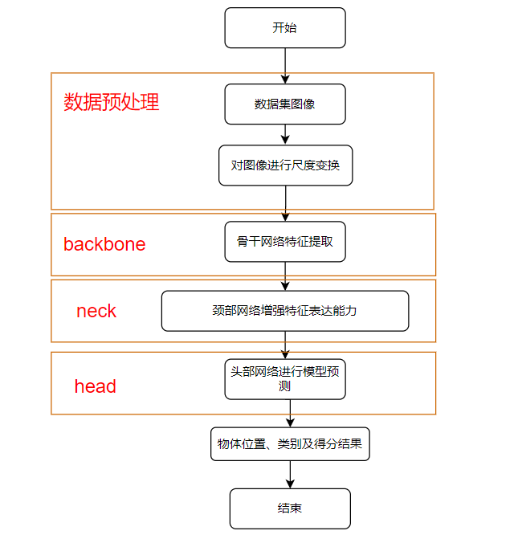
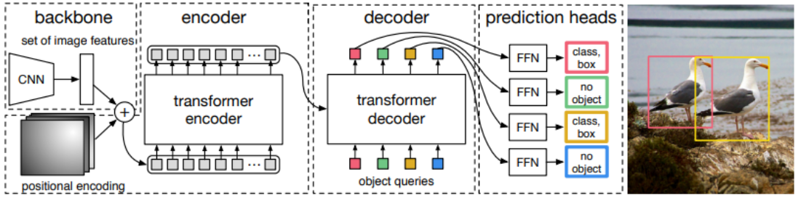
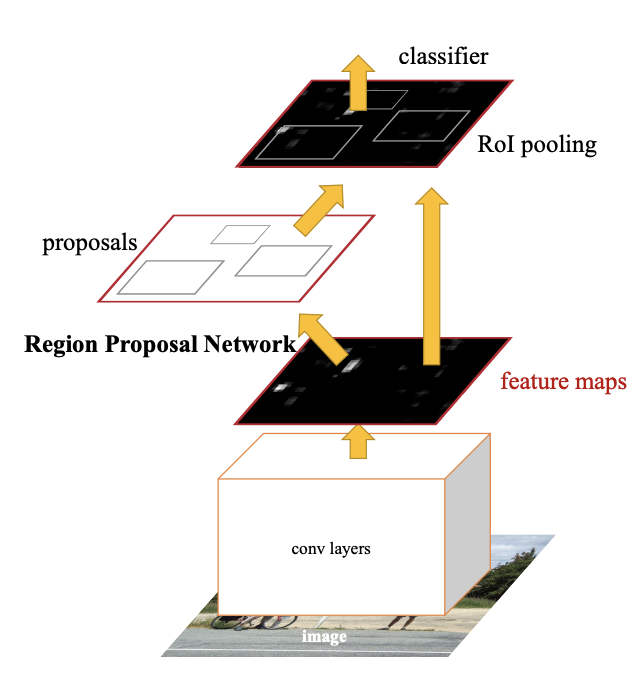
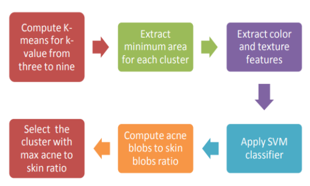
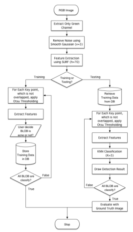
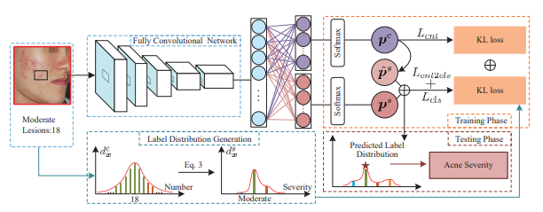
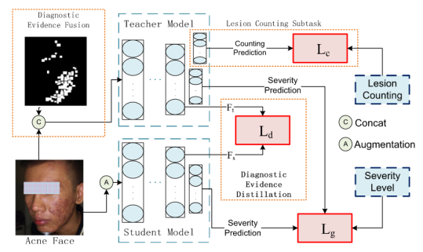
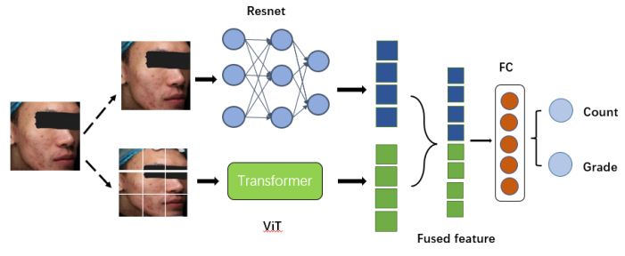

# 基于皮肤镜图像的痤疮分级任务

## 成员分工

- 饶稷：31%，主实验设计，模型调优
- 宓田田：23%，ResNet方法实现与ViT方法实现
- 李恒鑫：23%，痤疮检测方法调研，模型训练
- 李奥：23%，目标检测方法调研，实验环境构建

## 背景介绍

痤疮(acne)是一种常见的慢性炎症性皮肤疾病，主要症状表现为皮肤中的皮脂腺过度分泌油脂，或是皮肤中角质发生代谢异常，从而导致的毛孔堵塞。痤疮常发于青少年群体，据研究，痤疮常与压力过大，加班熬夜，饮食不规律等不良习惯有关，严重者影响患者的外观和生活质量。

目前，痤疮在皮肤科的发病率非常高，并且治疗方法也是多种多样。不同的痤疮治疗方法有不同的效果，在临床上常通过测试患者皮肤颜色、毛孔大小、油脂分泌等指标来进行临床评估，但这些指标通常只是一种事后评价或观察性评价。因此，对于已确诊为痤疮的患者而言，及时了解其治疗效果对于制定后续的护理方案及临床决策具有重要意义。

本项目通过利用深度学习方法自动检测人脸皮肤镜图像中痤疮的数量，来体现痤疮病情的严重程度。

## 问题分析

在痤疮检测和分级任务中，面临的主要挑战是痤疮通常为小目标，且在皮肤镜图像中的分布密集不均。我们在初步尝试中使用了YOLOv5和Faster-RCNN等目标检测模型，发现它们在小目标检测方面效果不理想，原因主要包括以下几点：

1. **小目标特征不明显**：痤疮的尺寸较小，相对于整个图像的比例较低，传统目标检测模型容易忽略小目标或难以准确定位。
2. **密集分布导致混淆**：痤疮在皮肤上的分布可能非常密集，目标检测模型在识别时容易将多个痤疮区域混淆，导致检测精度降低。
3. **背景复杂**：皮肤镜图像中的背景通常较为复杂，可能包括毛发、皮肤纹理等干扰因素，这些因素会对模型的检测能力造成干扰。

为了解决这些问题，我们调整了研究方向，从单纯的目标检测转向对整张图像中痤疮数量和整体严重程度的预测。这种方式能够更加全面地评估痤疮的情况，通过对整张图像进行全局分析，预测图像中痤疮的总数量，避免了单个痤疮区域检测的局限性，并且能够较好地处理痤疮的密集分布问题，通过整体评估，提高预测的准确性。

## 相关工作

### 计算机视觉中的目标检测框架

我们调研了计算机视觉领域的目标检测任务中一些常用的方法，包括YOLO-v5, DTER, Faster-Rcnn等。

####  【现成方法实验】YOLO-V5



YOLOv5 继承了YOLO系列算法的核心思想，即将目标检测任务视为一个回归问题，通过卷积神经网络直接预测目标的边界框和类别概率。YOLOv5 在预测时考虑整个图像的信息，而不是局部区域，这有助于减少背景错误和提高检测的准确性，整个检测流程可以通过梯度下降一次性完成，无需复杂的流程和额外的组件。YOLOv5 能够在保持高准确度的同时，实现快速的检测速度，适合多种应用场景。

#### 【现成方法实验】DTER



 DETR是第一个使用[Transformer](https://so.csdn.net/so/search?q=Transformer&spm=1001.2101.3001.7020)实现端到端目标检测的方法。这种方法不需要预定义的候选框或先验知识，并且可以同时执行分类和定位任务。

 工作流程：CNN生成的特征图将被送入Transformer，然后经过一系列的自注意力层和前馈神经网络层，最终得到一组对象的表示。每个对象的表示由一个类别分数和四个坐标值组成。这些类别分数和坐标值是预测得出的，它们表示对象在图像中的位置和类别信息。解码器将这些对象解码为一组检测结果。在解码过程中，匹配函数将预测类别和预测坐标与这些对象进行匹配，从而找到与预测类别和预测坐标最匹配的对象，并将其作为最终的检测结果输出。

#### 【现成方法实验】Faster-rcnn



在结构上，Faster RCNN将特征抽取(feature extraction)，proposal提取，bounding box regression(rect refine)，classification都整合在了一个网络中。

依作者看来，如上图，Faster RCNN其实可以分为4个主要内容：

1. Conv layers。作为一种CNN网络目标检测方法，Faster RCNN首先使用一组基础的conv+relu+pooling层提取image的feature maps。该feature maps被共享用于后续RPN层和全连接层。
2. Region Proposal Networks。RPN网络用于生成region proposals。该层通过softmax判断anchors属于positive或者negative，再利用bounding box regression修正anchors获得精确的proposals。
3. Roi Pooling。该层收集输入的feature maps和proposals，综合这些信息后提取proposal feature maps，送入后续全连接层判定目标类别。
4. Classification。利用proposal feature maps计算proposal的类别，同时再次bounding box regression获得检测框最终的精确位置。

其中，为了适应本任务数据特征：痤疮小且数量多的特点，我们将anchor选择框适当缩小；最终最好的结果，四类别平均准确率也仅仅在10%左右。

### 痤疮分级与应用

一般来说，这些方法可以分为两大类: 传统的基于计算机视觉的方法和基于机器学习的方法以及基于深度学习的方法。这部分总结了这两组中的一些主要研究。

#### 【方法研究】Digital Assessment of Facial Acne Vulgaris(2014 I2MTC Proceedings)



这篇文章介绍了一个基于特征提取和支持向量机（SVM）的自动化痤疮分级系统。系统将痤疮严重程度划分为四个级别：轻度、中度、重度和极重度。分级过程从涉及光照补偿的图像预处理开始，以提高分析的一致性和准确性。

为了精确衡量皮肤色差，本系统采用了CIE La*b*颜色空间。此外，使用了一种自动优化的K均值聚类算法来分割痤疮区域，并结合支持向量机分类器对痤疮类型进行分类。

系统主要通过颜色和直径这两个特征来识别和区分不同类型的痤疮，如丘疹、脓包、结节或囊肿。基于这些特征，系统进一步评估痤疮的严重程度，分类为轻度、中度、重度和极重度，为临床诊断和治疗提供参考。

#### 【方法研究】Acne Detection Using Speeded up Robust Features and Quantification Using K-Nearest Neighbors Algorithm (2014 ICCBS)




这篇文章提出了一种使用加速稳健特征（SURF）进行痤疮检测的方法，并根据五种设计的特征进行分类：色调均值、红色的标准偏差（SD）、绿色的标准偏差、蓝色的标准偏差以及圆度。此外，还采用了K最近邻（KNN）算法进行量化评估。研究结果显示，该方法的平均准确率为68%，敏感性为73%，精确度为84%。然而，这样的准确率对于临床目的来说是不够的。

#### 【方法复现与思路借鉴】Joint Acne Image Grading and Counting via Label Distribution Learning(2019 ICCV)




这篇文章采用标签分布学习（LDL）方法解决了痤疮图像分析问题，考虑到痤疮严重程度之间的模糊信息。根据专业的分级标准生成了两种痤疮标签分布，分别考虑了类似病变数量与痤疮严重程度之间的关系。这篇文章还提出了一个统一的框架，用于联合痤疮图像分级和计数，该框架通过多任务学习损失进行优化。此外，这篇文章进一步构建了ACNE04数据集，其中包括每张图像的痤疮严重程度和病变数量的注释，以便进行评估。

输入图像被重新调整大小并通过CNN主干模型（ResNet-50）处理。然后，框架分为两个分支。分级分支全局估计痤疮的严重程度。计数分支首先预测痤疮病变数量的标签分布。然后将其转换为痤疮严重程度的标签分布。计数模型同时对痤疮严重程度进行分级，并预测病变数量，以提供痤疮诊断的证据。最后，根据医学标准，将全局分级和局部计数模型的预测结果合并。

#### 【思路借鉴】DED: Diagnostic Evidence Distillation for acne severity grading on face images (2023 Expert Systems With Applications EI)



此研究提出了一种适合痤疮诊断特点的诊断方法——诊断证据提取法(DED) ，它可以应用于不同痤疮诊断标准下的痤疮诊断。首先，我们充分调查和分析各种痤疮标准的共性，将面部痤疮诊断浓缩为一个非常规的图像分类问题，基于诊断证据的类型和细粒度病变的数量分布在整个面部。接下来，该框架利用师生结构的知识提取方法，将新患者无法获得的诊断证据，只能在训练数据中获得的诊断证据，引入到诊断模型中。

为了打破不同标准的局限性，该框架使用卷积神经网络(CNN)作为骨干来模拟皮肤病学的全局评估。提出了一种教师网络的子任务联合学习，以加强对学生的引导。基于不同的主流痤疮诊断标准，DED 被应用于两个数据集 ACNE04和 PLSBRACNE01的痤疮诊断。实验结果表明，在这两个数据集上，DED 有效地提高了诊断性能，超过了最先进的水平，达到了皮肤科医生的诊断水平。

## 数据集介绍

我们对已经公开的数据集进行了收集，结果如下：

### 【方法研究】**CelebAMask-HQ**

- **描述**: CelebAMask-HQ 是一个基于 CelebA-HQ 数据集制作的大规模人脸图像数据集，从原始的 CelebA 数据集中选取了 30,000 张高分辨率人脸图像。每幅图像都配备了对应的面部属性分割掩模，手工标注的掩模分辨率为 512×512，包含 19 个类别，如皮肤、鼻子、眼睛、眉毛、耳朵、口腔、嘴唇、头发、帽子、眼镜、耳环、项链、脖子和衣服等面部组件和配饰。

### 【方法研究】**Flickr-Faces-HQ (FFHQ)**

- **描述**: FFHQ 是为生成对抗网络（GAN）基准测试而创建的高质量人脸图像数据集，包含 70,000 张 1024×1024 分辨率的高质量 PNG 图像。该数据集展现了年龄、种族和背景的广泛多样性，并包含眼镜、太阳镜等配饰。部分数据集经过了经验丰富的皮肤科医生的重新注释，涵盖了 2,307 张图像，用于痤疮严重程度的分类，最终因样本不平衡转化为二元分类问题。

### 【方法研究】**Nestlé Skin Health**

- **描述**: 由微软与雀巢皮肤健康盾（NSH）合作的数据集，专注于皮肤病学条件或皮肤健康。这个数据集用于医学图像分析，特别是用于根据上传的自拍图片评估用户痤疮的严重程度，提供与皮肤科医生相当的诊断准确性。此外，该数据集还推荐适合用户痤疮严重程度的治疗方案和护肤产品，同时提供性别、年龄、皮肤类型等人口统计信息。

### 【方法研究】**ACNE04 & ACNE-Shanghai**

- **描述**: ACNE04 数据集包含 3,756 张包含痤疮的人脸图像，用于痤疮图像的分级和计数研究。该数据集按照 Hayashi 标准进行了局部病变数量和全局痤疮严重程度的注释。

|        **Name**        |    **images**     | **size**  | **classes(including background)** |
| :--------------------: | :---------------: | :-------: | :-------------------------------: |
|   **CelebAMask-HQ**    |       30000       |  512×512  |                 4                 |
|  **Flickr-Faces-HQ**   |       1572        |  224×224  |                 -                 |
| **Nestlé Skin Health** |       4700        |  224×224  |                 5                 |
|       **ACNE04**       |       1457        | 3112×3456 |                 5                 |
|   **ACNE-Shanghai**    | 322(309 selected) | 3456×5184 |                 5                 |

## 解决思路

### 数据收集与预处理

- 收集大量带有痤疮标签的皮肤镜图像数据，这些图像应包括不同类型和不同严重程度的痤疮。我们以ACNE04数据集作为我们可使用的数据。
- 对图像数据进行预处理，包括图像的裁剪、缩放、去噪等处理，以提高图像质量和算法的鲁棒性。
- 划分训练集、验证集和测试集，其中，80%的数据用于训练和验证，20%的数据用于测试。模型选择采用5折交叉验证法，保证模型训练和评估的公正性。

### 模型选择与构建

- 模型的输入为预处理后的皮肤镜图像，输出为痤疮的数量和严重程度。
- **ResNet（Residual Network）**：ResNet通过引入残差连接，解决了深层神经网络训练中的梯度消失问题。其结构相对成熟，能够有效提取图像的多层次特征，适用于痤疮数量和严重程度的预测。

  **ViT（Vision Transformer）**：ViT通过自注意力机制，能够捕捉图像中不同区域之间的全局关系，特别适合处理复杂背景下的小目标检测任务。ViT将图像划分为若干固定大小的patch，并通过Transformer对每个patch进行编码，最终整合这些特征进行痤疮数量和严重程度的预测。

### 模型训练

- 使用训练集对模型进行训练，利用交叉熵损失函数或均方误差损失函数来优化模型参数。
- 在训练过程中，采用数据增强技术（如随机裁剪、旋转、翻转等）来增加数据的多样性，防止模型过拟合。
- 通过验证集对模型进行验证和调参，以获得最佳的模型性能。

### 模型评估与优化

- 使用测试集对模型进行最终评估，通过一系列指标来衡量模型的性能。
- 结合实际需求，进一步优化模型结构和参数，以提高检测和分级的准确性和效率。

## 方法设计

### 【已有方法复现, 创新点: 架构设计与特征融合】网络设置

【已有方法复现】ResNet（Residual Network）是一种经典的深度卷积神经网络（CNN），通过引入残差连接来解决深层网络训练中的梯度消失问题。我们将利用ResNet模型来预测皮肤镜图像中的痤疮数量和严重程度。

```python
# ResNet
class BasicBlock(nn.Module):
    expansion = 1

    def __init__(self, inplanes, planes, stride=1, downsample=None):
        super(BasicBlock, self).__init__()
        self.conv1 = conv3x3(inplanes, planes, stride)
        self.bn1 = nn.BatchNorm2d(planes)
        self.relu = nn.ReLU(inplace=True)
        self.conv2 = conv3x3(planes, planes)
        self.bn2 = nn.BatchNorm2d(planes)
        self.downsample = downsample
        self.stride = stride

    def forward(self, x):
        residual = x
        out = self.conv1(x)
        out = self.bn1(out)
        out = self.relu(out)
        out = self.conv2(out)
        out = self.bn2(out)
        if self.downsample is not None:
            residual = self.downsample(x)
        out += residual
        out = self.relu(out)
        return out
```

【已有方法复现】ViT：模型设计采用多分支网络结构，不同分支负责提取不同尺度和不同语义层次的特征。每个分支可以专注于图像的某一特定方面，确保全面捕捉图像信息，并且引入通道注意力机制，增强补丁嵌入的特征提取能力。通道注意力机制能够动态调整每个通道的重要性，使模型更加关注关键特征，提高整体特征表示的质量。

```python
class ViT(nn.Module):
    def __init__(self, *, image_size, patch_size, num_classes, dim, depth, heads, mlp_dim, pool='cls', channels=3,
                 dim_head=64, dropout=0., emb_dropout=0.):
        super().__init__()
        image_height, image_width = pair(image_size)
        patch_height, patch_width = pair(patch_size)
        assert image_height % patch_height == 0 and image_width % patch_width == 0, 'Image dimensions must be divisible by the patch size.'
        num_patches = (image_height // patch_height) * (image_width // patch_width)
        patch_dim = channels * patch_height * patch_width
        self.to_patch_embedding = nn.Sequential(
            Rearrange('b c (h p1) (w p2) -> b (h w) (p1 p2 c)', p1=patch_height, p2=patch_width),
            nn.Linear(patch_dim, dim),
        )
        self.pos_embedding = nn.Parameter(torch.randn(1, num_patches + 1, dim))
        self.cls_token = nn.Parameter(torch.randn(1, 1, dim))
        self.dropout = nn.Dropout(emb_dropout)
        self.transformer = Transformer(dim, depth, heads, dim_head, mlp_dim, dropout)
        self.pool = pool
        self.to_latent = nn.Identity()
        self.mlp_head = nn.Sequential(
            nn.LayerNorm(dim),
            nn.Linear(dim, num_classes)
        )

    def forward(self, img):
        x = self.to_patch_embedding(img)
        b, n, _ = x.shape
        cls_tokens = repeat(self.cls_token, '1 1 d -> b 1 d', b=b)
        x = torch.cat((cls_tokens, x), dim=1)
        x += self.pos_embedding[:, :(n + 1)]
        x = self.dropout(x)
        x = self.transformer(x)
        x = x.mean(dim=1) if self.pool == 'mean' else x[:, 0]
        x = self.to_latent(x)
        return self.mlp_head(x)
```

【创新点: 架构设计与特征融合】我们提出的模型结合了两种神经网络架构：ResNet和Vision Transformer，以及一个特征融合和分类模块。在这里，ResNet被用来处理输入的皮肤图像，捕捉局部的纹理和形状信息。ResNet的输出是一系列特征图，这些特征图包含了从输入图像中提取的关键信息。ViT将图像分割成多个小块（patches），然后利用自注意力机制来理解各个块之间的关系。这有助于模型捕获图像的全局特征。

图中显示了一个将ResNet和ViT输出的特征合并的步骤。特征融合是一个重要的过程，因为它结合了局部特征和全局特征，为最终的分类提供了一个更全面的信息视图。融合后的特征被送入一个或多个全连接层，这些层的目的是基于提取和融合的特征来做出最终的判断。



```python
class FusionModel(nn.Module):
    def __init__(self, num_classes, num_count, hidden_dim=1024):
        super(FusionModel, self).__init__()
        self.vit = ViT(image_size=224, patch_size=16, num_classes=hidden_dim, dim=512, depth=16, heads=8, mlp_dim=1024,
                       dropout=0.1, emb_dropout=0.1)
        self.resnet = resnet50(hidden_dim)
        self.fc = nn.Linear(hidden_dim, num_classes)
        self.counting = nn.Linear(hidden_dim, num_count)  # 添加用于计数的全连接层

    def forward(self, x, tem):
        vit_features = self.vit(x)
        # resnet_features = self.resnet(x)
        # features = torch.cat((vit_features, resnet_features), dim=1)
        features = vit_features
        features = features.view(features.size(0), -1)

        cls = self.fc(features)
        cou = self.counting(features)

        cls = F.softmax(cls, dim=1) + 1e-4
        cou = F.softmax(cou, dim=1) + 1e-4  # 避免除零错误

        cou2cls = torch.stack((torch.sum(cou[:, :5], 1),
                               torch.sum(cou[:, 5:20], 1),
                               torch.sum(cou[:, 20:50], 1),
                               torch.sum(cou[:, 50:], 1)), 1)  # 模型预测结果

        # Exception
        # cou2cou = torch.sum(cou * torch.from_numpy(np.array(range(1, 66))).float().cuda(), 1)

        return cls, cou, cou2cls
```


### 【已有方法的借鉴】损失函数设置：

由于我们需要同时预测图片对应的类别和痤疮的个数，我们按照ACNE04数据集中的设置，将预测个数为0-19的图片规定为第一类(class0)，预测个数为20-50的图片规定为第二类(class1)，预测个数为50-65的图片规定为第三类(class2)，预测个数超过65的图片规定为第四类(class3)，这样就只需要计算痤疮个数的损失函数了，我们用L2作为损失函数。
$$
L_{cou}=\sum_{i=1}^{N}(x_{cou}^{(i)}-y_{cou}^{(i)})^2
$$
后来发现模型效果很差，因为数据集给出了每张图片的类别标签，所以【已有方法的借鉴】我们决定添加类别的误差项：KL散度（Kullback-Leibler Divergence），又称为相对熵，是一种衡量两个概率分布之间差异的指标。具体来说，KL散度衡量的是一个概率分布相对于另一个概率分布的差异程度。

假设有两个概率分布 $P$ 和 $Q$，它们定义在同一个概率空间上。KL散度定义如下：
$$
D_{\text{KL}}(P \parallel Q) = \sum_{x} P(x) \log \frac{P(x)}{Q(x)}
$$
我们把预测出的痤疮类型建模成概率分布，然后衡量其与真实分布间的差异：

```python
ld_num = len(label_set)
dif_age = np.tile(label_set.reshape(ld_num, 1), (1, len(label))) - np.tile(label, (ld_num, 1))
ld = 1.0 / np.tile(np.sqrt(2.0 * np.pi) * sigma, (ld_num, 1)) * np.exp(-1.0 * np.power(dif_age, 2) / np.tile(2.0 * np.power(sigma, 2), (ld_num, 1)))  # 计算高斯分布的标准差项
ld = ld / np.sum(ld, 0)

return ld.transpose()
```

$$
L_{cls}=\sum_{i=1}^{N}D_{KL}(x_{cls}^{(i)}-y_{cls}^{(i)})
$$

后续我们也将计数误差使用了KL散度来计算，我们的损失函数为：
$$
Loss=\alpha L_{cou}+(1-\alpha)L_{cls}
$$
但这里我们遗漏了我们的网络将计数转化为类别的误差，所以还需要补上$L_{cou2cls}$误差项，最后$\alpha$取0.6，我们的损失函数设计为：
$$
Loss=\frac{\alpha}{2}(L_{cou2cls}+L_{cou})+(1-\alpha)L_{cls}
$$

```python
# generating counting_distribution
counting = counting - 1  # ？
counting_distribution = generate_distribution(counting, config_dict["sigma"], 'klloss', 65)
# 计算各个类别的总和
grading_distribution = np.vstack((np.sum(counting_distribution[:, :5], 1), np.sum(counting_distribution[:, 5:20], 1), np.sum(counting_distribution[:, 20:50], 1), np.sum(counting_distribution[:, 50:], 1))).transpose()
counting_distribution = torch.from_numpy(counting_distribution).cuda().float()
grading_distribution = torch.from_numpy(grading_distribution).cuda().float()

# train
config_dict["cnn"].train()

cls, cou, cou2cls = config_dict["cnn"](image, None)  # nn output
loss_cls = config_dict["kl_loss_1"](torch.log(cls), grading_distribution) * 4.0
loss_cou = config_dict["kl_loss_2"](torch.log(cou), counting_distribution) * 65.0
loss_cls_cou = config_dict["kl_loss_3"](torch.log(cou2cls), grading_distribution) * 4.0
loss = (loss_cls + loss_cls_cou) * 0.5 * config_dict["lam"] + loss_cou * (1.0 - config_dict["lam"])

config_dict["optimizer"].zero_grad()           # clear gradients for this training step
loss.backward()                 # backpropagation, compute gradients
config_dict["optimizer"].step()                # apply gradients

losses_cls.update(loss_cls.item(), image.size(0))
losses_cou.update(loss_cou.item(), image.size(0))
losses_cou2cls.update(loss_cls_cou.item(), image.size(0))
losses.update(loss.item(), image.size(0))  # 更新损失函数的累计值
```

### 【已有方法】优化器设置

我们选取了SGD和Adam作为我们的优化器，经过实验后我们发现Adam方法在我们的任务中更有效。

1. 添加`argparse`方便调参：

   ```python
   if __name__ == "__main__":
       # 创建命令行参数解析器
       parser = argparse.ArgumentParser(description="")
   
       # 添加超参数
       parser.add_argument("--method", default="FusionModel", choices=["FusionModel", "ResNet"])
       parser.add_argument("--batch_size", type=int, default=64)
       parser.add_argument("--batch_size_test", type=int, default=20)
       parser.add_argument("--lr", type=float, default=1e-4)
       parser.add_argument("--weight_decay", type=float, default=5e-4)
       parser.add_argument("--num_workers", type=int, default=12)
       parser.add_argument("--num_classes", type=int, default=4)
       parser.add_argument("--config_path", type=str, default="./configs/config.yaml")
       parser.add_argument("--model_path", type=str, default="")
       parser.add_argument("--dataset_path", type=str, default="./data")
       parser.add_argument("--cross_validation", type=int, default=5)
       parser.add_argument("--image_rotation", type=int, default=20)
       parser.add_argument("--image_resize", type=int, default=256)
       parser.add_argument("--train_size", type=int, default=224)
       parser.add_argument("--num_epochs", type=int, default=120)
       parser.add_argument("--lr_steps", type=int, default=30)
       parser.add_argument("--sigma", type=float, default=30 * 0.1)
       parser.add_argument("--lam", type=float, default=6 * 0.1)
       parser.add_argument("--frequency", type=int, default=30)
   
       # 解析命令行参数
       main_args = parser.parse_args()
   
       # 调用主函数
       main(main_args)
   ```


## 实验结果

|             | Precision |   SE   |   SP   |   YI   |  MAE   |   MSE   |
| :---------: | :-------: | :----: | :----: | :----: | :----: | :-----: |
|   class0    |  0.7863   | 0.8932 | 0.8677 | 0.7609 | 1.0680 | 1.6010  |
|   class1    |  0.8000   | 0.7874 | 0.8485 | 0.6359 | 2.8425 | 3.6121  |
|   class2    |  0.7692   | 0.5556 | 0.9766 | 0.5321 | 9.1111 | 13.7477 |
|   class3    |  0.8750   | 0.8077 | 0.9887 | 0.7964 | 7.0769 | 12.8333 |
| avg / total |  0.8076   | 0.7610 | 0.9204 | 0.6813 | 3.3664 | 6.6742  |

Table 1. ViT+ResNet(KL-Loss) 在痤疮数量的预测效果：AVE_ACC=0.7979

|             | Precision |   SE   |   SP   |   YI   |
| :---------: | :-------: | :----: | :----: | :----: |
|   class0    |  0.8108   | 0.8738 | 0.8889 | 0.7627 |
|   class1    |  0.7923   | 0.8110 | 0.8364 | 0.6474 |
|   class2    |  0.7407   | 0.5556 | 0.9727 | 0.5282 |
|   class3    |  0.8750   | 0.8077 | 0.9887 | 0.7964 |
| avg / total |  0.8047   | 0.7620 | 0.9217 | 0.6837 |

Table 2. ViT+ResNet(KL-Loss) 在痤疮严重程度的预测效果：AVE_ACC=0.8014

|             | Precision |   SE   |   SP   |   YI   |   MAE   |   MSE   |
| :---------: | :-------: | :----: | :----: | :----: | :-----: | :-----: |
|   class0    |  0.5596   | 0.5922 | 0.7460 | 0.3383 | 2.6505  | 6.6105  |
|   class1    |  0.5372   | 0.5118 | 0.6606 | 0.1724 | 6.1024  | 10.2054 |
|   class2    |  0.3214   | 0.2500 | 0.9258 | 0.1758 | 17.5833 | 19.5256 |
|   class3    |  0.6176   | 0.8077 | 0.9511 | 0.7588 | 9.9615  | 17.5269 |
| avg / total |  0.5090   | 0.5404 | 0.8209 | 0.3613 | 6.6438  | 11.6219 |

Table 3. ViT(KL-Loss) 在痤疮数量的预测效果：AVE_ACC=0.5342

|             | Precision |   SE   |   SP   |   YI   |
| :---------: | :-------: | :----: | :----: | :----: |
|   class0    |  0.5586   | 0.6019 | 0.7407 | 0.3427 |
|   class1    |  0.5339   | 0.4961 | 0.6667 | 0.1627 |
|   class2    |  0.3448   | 0.2778 | 0.9258 | 0.2036 |
|   class3    |  0.6176   | 0.8077 | 0.9511 | 0.7588 |
| avg / total |  0.5137   | 0.5459 | 0.8211 | 0.3669 |

Table 4. ViT(KL-Loss) 在痤疮严重程度的预测效果AVE_ACC=0.5342

|             | Precision |   SE   |   SP   |   YI   |   MAE   |   MSE   |
| :---------: | :-------: | :----: | :----: | :----: | :-----: | :-----: |
|   class0    |  0.7312   | 0.6602 | 0.8677 | 0.5279 | 2.2718  | 3.1776  |
|   class1    |  0.6395   | 0.7402 | 0.6788 | 0.4189 | 4.1811  | 7.6442  |
|   class2    |  0.5556   | 0.4167 | 0.9531 | 0.3698 | 11.4444 | 15.8289 |
|   class3    |  0.7200   | 0.6923 | 0.9737 | 0.6660 | 13.0769 | 20.2314 |
| avg / total |  0.6615   | 0.6273 | 0.8683 | 0.4957 | 5.1952  | 9.8138  |

Table 5. ResNet(KL-Loss) 在痤疮数量的预测效果：AVE_ACC=0.6678

|             | Precision |   SE   |   SP   |   YI   |
| :---------: | :-------: | :----: | :----: | :----: |
|   class0    |  0.7391   | 0.6602 | 0.8730 | 0.5332 |
|   class1    |  0.6419   | 0.7480 | 0.6788 | 0.4268 |
|   class2    |  0.5517   | 0.4444 | 0.9492 | 0.3937 |
|   class3    |  0.7391   | 0.6538 | 0.9774 | 0.6313 |
| avg / total |  0.6680   | 0.6266 | 0.8696 | 0.4962 |

Table 6. ResNet(KL-Loss) 在痤疮严重程度的预测效果：AVE_ACC=0.6712

## 分析与讨论

### Q1：为什么Yolo等目标检测框架没有在痤疮检测上取得明显效果？

A1：传统深度卷积神经网络在处理高分辨率图像时可能出现低分辨率特征表示和空间信息丢失的问题（高维诅咒），虽然采用Yolov8作为痤疮项目中的目标检测模块，能够适应不同尺寸和形状的目标检测任务，但是对于痤疮这样的小目标还是会在调参上带来不小的麻烦。

当训练图片分辨率过大时，网络的感受野（receptive field）相对于整个图片来说可能过小，这意味着网络可能无法有效地捕捉到全局和局部的特征，特别是在处理高分辨率图像时。小目标的特征可能会在下采样过程中丢失，导致网络无法有效检测到小目标。由于小目标占据的像素较少，计算损失时可能会被放大，影响训练效果。

### Q2：为什么ViT的效果比较差？

A2：因为ViT网络需要对图片进行patch操作，在切分的过程中，如果痤疮处在边界位置，那么痤疮可能会被重复计数，在边缘的痤疮会被计数1次，极端情况下，处于边角的痤疮会被计数4次，造成较大的计数偏差。

## 参考资料

> [CCID Dataset] Quattrini A, Boër C, Leidi T, Paydar R. A Deep Learning-Based Facial Acne Classification System. Clin Cosmet Investig Dermatol. 2022;15:851-857https://doi.org/10.2147/CCID.S360450
>
> [ACNE04 Dataset] Wu, Xiaoping, Ni, Wen, Jie, Liang, Lai, Yu-Kun, Cheng, Dongyu, She, Ming-Ming, & Yang, Jufeng. (2019). Joint Acne Image Grading and Counting via Label Distribution Learning. In *IEEE International Conference on Computer Vision*.
>
> [Nestlé Skin Health Dataset] https://github.com/microsoft/nestle-acne-assessment
>
> [Flickr-Faces-HQ Dataset] https://github.com/HuynhThanhQuan/skin-detective
> Islam, Md Baharul, Masum Shah Junayed, Arezoo Sadeghzadeh, Nipa Anjum, Afsana Ahsan, A. F. M. Shahen Shah. (2023). Acne Vulgaris Detection and Classification: A Dual Integrated Deep CNN Model.
>
> Lin, Yi, Jingchi Jiang, Dongxin Chen, Zhaoyang Ma, Yi Guan, Xiguang Liu, Haiyan Yo, Jing Yang. DED: Diagnostic Evidence Distillation for Acne Severity Grading on Face Images. Expert Systems with Applications 228 (2023): 120312. 